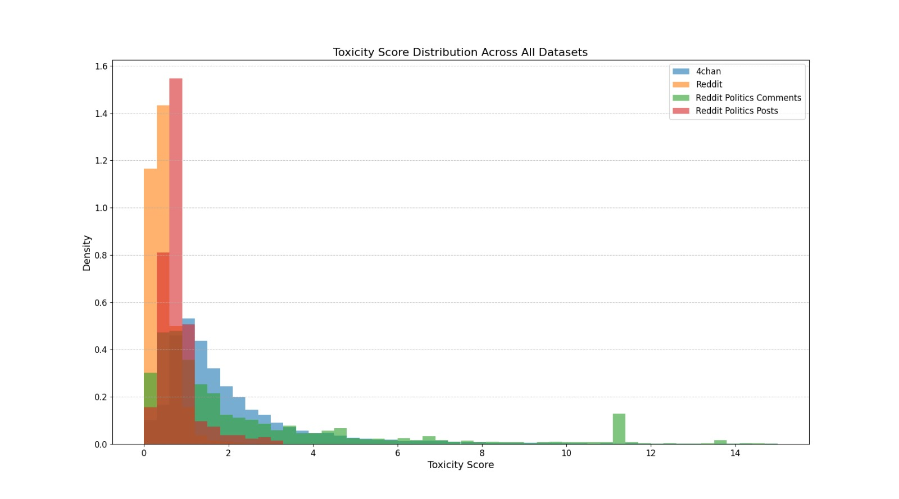
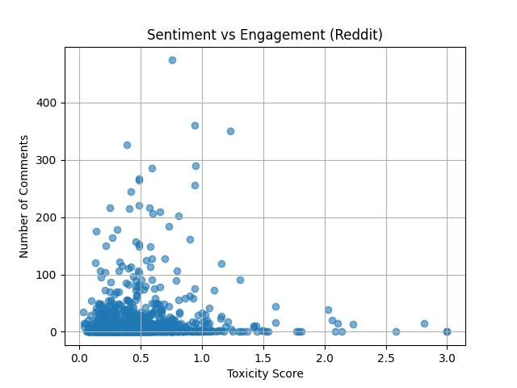
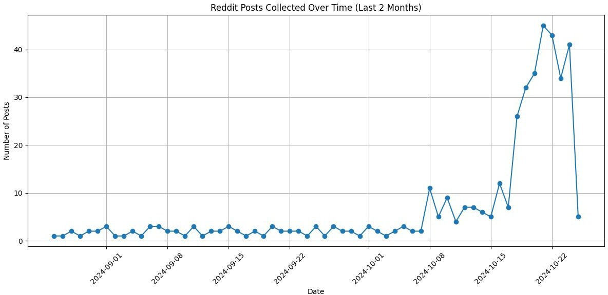
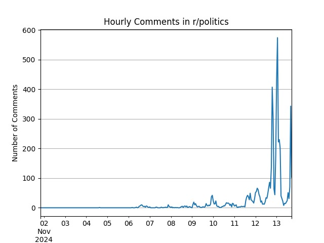

# Social Media Data Analysis on Fitness

An end-to-end social media analytics project analyzing toxicity, sentiment, and engagement
patterns in fitness-related discussions across Reddit and 4chan. Built across three phases —
data collection, analysis, and an interactive Flask dashboard — using Python, PostgreSQL/TimescaleDB,
and Docker.

**Team project** (SUNY Binghamton, CS515) — built with Vishakha Bhujbal and Aishwarya Ingale.
My contributions spanned all three phases: data collection infrastructure, toxicity/sentiment
analysis, and dashboard development.

## What it does

- Continuously collects posts and comments from fitness-related subreddits (r/fitness,
  r/nutrition) and 4chan's /fit/ board via scheduled crawlers
- Scores content for toxicity (via the Moderate Hatespeech API) and sentiment
- Surfaces engagement patterns — how toxicity relates to comment volume, how sentiment and
  toxicity trend over time, and how platforms differ
- Presents findings through an interactive Flask dashboard with configurable date ranges

## Screenshots

**Toxicity distribution across platforms** — comparing 4chan, Reddit, and Reddit political
discussions:



**Sentiment vs. engagement** — relationship between toxicity score and comment volume:



**Data collection growth over time** — Reddit posts collected across the crawl period:



**Dashboard output — hourly comment activity:**



*(Full-resolution charts and additional views are in the `project-2-report-datadrift-main`
and `project-3-report-datadrift-main` PDFs.)*

## Architecture

```
Reddit API ─┐
            ├─→ Python crawlers (reddit_crawler.py, chan_crawler.py)
4chan API ──┘         │
                       ▼
              PostgreSQL / TimescaleDB
                       │
                       ▼
         Toxicity + sentiment analysis (Analysis.py)
                       │
                       ▼
              Flask dashboard (app.py)
```

## Tech Stack

- **Languages:** Python, HTML, CSS
- **Backend / Dashboard:** Flask
- **Database:** PostgreSQL, TimescaleDB
- **Data Processing:** Pandas, NumPy
- **Visualization:** Matplotlib, Seaborn
- **Text Analysis:** Toxicity scoring (Moderate Hatespeech API), sentiment analysis
- **Infrastructure:** Docker, Faktory (background job processing), Linux VM
- **Other:** SQL migrations, virtual environments

## Challenges — what actually broke and how it was fixed

- **Reddit API rate limits:** Reddit throttles request volume, which was silently slowing and
  risking failures in the crawler. Fixed by adding a one-second delay between requests —
  a small change, but it was the difference between a crawler that ran reliably for weeks
  and one that got cut off mid-collection.
- **4chan's unstructured data:** Raw 4chan posts came through full of slang and embedded HTML
  tags that broke naive text processing. Built a dedicated cleaning function to normalize this
  before it could reach the analysis layer.
- **Slow query performance at scale:** As the dataset grew, queries against the raw tables
  started slowing down. Addressed with query optimization and batched processing in Pandas
  rather than pulling full tables into memory.
- **A real methodological limitation, documented rather than hidden:** the project used toxicity
  score as a proxy for sentiment rather than running full sentiment analysis. That's a legitimate
  tradeoff for scope, but it means the sentiment findings are narrower than a dedicated NLP
  sentiment model would produce — worth stating plainly rather than overselling the results.

## Results and Insights

- Reddit produced significantly higher post volume; 4chan produced fewer posts but with
  markedly higher toxicity, especially around controversial topics like extreme diets and
  body image
- Posts with moderate toxicity (roughly 0.4–0.6 on the measured scale) drew the highest
  engagement — both very low-toxicity and very high-toxicity posts saw less interaction
- Toxicity and sentiment activity both showed clear day-to-day volatility rather than staying
  flat, suggesting engagement is event-driven rather than constant

## How to Run

```bash
git clone https://github.com/aakanksha105/Social-Media-Data-Analysis-on-Fitness.git
cd Social-Media-Data-Analysis-on-Fitness

python -m venv env/dev
source env/dev/bin/activate
pip install -r requirements.txt

docker pull timescale/timescaledb-ha:pg16
docker run -d --name timescaledb -p 5432:5432 -e POSTGRES_PASSWORD=testpassword timescale/timescaledb-ha:pg16

# Run analysis
python3 Analysis.py

# Run the dashboard
python3 background.py
python3 app.py
# then open http://127.0.0.1:5000/
```


